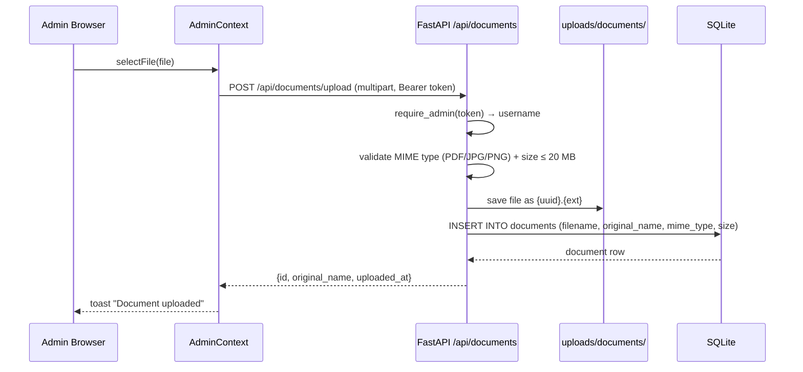
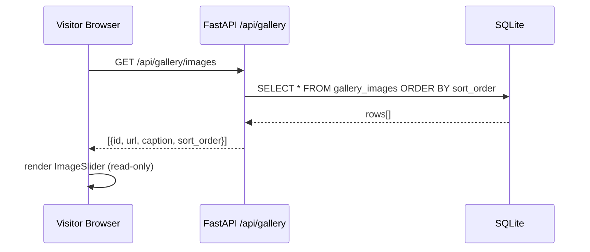
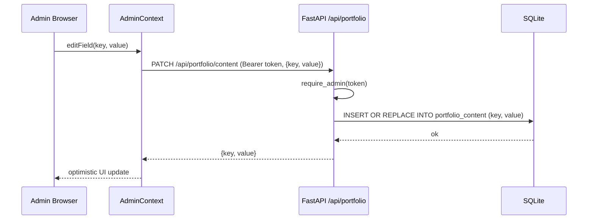

# Design Document: Admin Content Management

## Overview

This feature extends the existing React + FastAPI portfolio with a fully dynamic, database-driven content management system accessible only to the authenticated admin. It covers four capability areas: private document management (PDF/JPG/PNG), an image slider/carousel with admin-managed images, dynamic portfolio content editing (name, bio, education, contact, stats), and a projects persistence layer that replaces the current in-memory context. All data is stored in SQLite via aiosqlite, consistent with the existing stack. Normal visitors see a read-only view; the admin (authenticated via the existing JWT system) gains full CRUD access through an in-page admin panel.

The design integrates cleanly with the existing `require_admin` FastAPI dependency, the `authFetch()` helper in `AdminContext`, and the existing `UPLOAD_DIR` / `init_db()` patterns already established in `database.py` and `routers/resume.py`.

---

## Architecture

```mermaid
graph TD
    subgraph Frontend ["Frontend (React + Vite)"]
        A[AdminContext<br/>JWT + authFetch] --> B[AdminDashboard<br/>modal/panel]
        B --> C[DocumentManager]
        B --> D[ImageSliderManager]
        B --> E[PortfolioEditor]
        B --> F[ProjectsManager]
        G[PublicView] --> H[ImageSlider<br/>read-only]
        G --> I[Hero / About / Contact<br/>DB-driven]
        G --> J[Projects<br/>DB-driven]
    end

    subgraph Backend ["Backend (FastAPI)"]
        K[/api/documents] --> N[SQLite via aiosqlite]
        L[/api/gallery] --> N
        M[/api/portfolio] --> N
        O[/api/projects] --> N
        P[/api/auth] --> N
        Q[Static file serving<br/>/uploads/*] --> R[uploads/ directory]
    end

    A -->|authFetch + Bearer JWT| K
    A -->|authFetch + Bearer JWT| L
    A -->|authFetch + Bearer JWT| M
    A -->|authFetch + Bearer JWT| O
    H -->|public GET| L
    I -->|public GET| M
    J -->|public GET| O
```

---

## Sequence Diagrams

### Admin Document Upload



### Public Image Slider Load



### Portfolio Content Edit



---

## Components and Interfaces

### Backend: Documents Router (`routers/documents.py`)

**Purpose**: Manage private file uploads (PDF, JPG, PNG). All write operations require admin JWT. Read/download operations are also admin-only (documents are private).

**Interface**:
```typescript
// Public shape of document record returned by API
interface DocumentRecord {
  id: number
  original_name: string
  mime_type: string
  size_bytes: number
  uploaded_at: string   // ISO datetime
}
```

**Endpoints**:
| Method | Path | Auth | Description |
|--------|------|------|-------------|
| GET | `/api/documents/` | Admin | List all documents |
| POST | `/api/documents/upload` | Admin | Upload new document |
| GET | `/api/documents/{id}/download` | Admin | Download a document |
| DELETE | `/api/documents/{id}` | Admin | Delete a document |

**Responsibilities**:
- Validate MIME type against allowlist: `application/pdf`, `image/jpeg`, `image/png`
- Enforce max file size (20 MB)
- Store files in `uploads/documents/{uuid}.{ext}`
- Persist metadata in `documents` table
- On delete: remove file from disk and DB row

---

### Backend: Gallery Router (`routers/gallery.py`)

**Purpose**: Manage slider images. Upload is admin-only; listing is public.

**Interface**:
```typescript
interface GalleryImage {
  id: number
  filename: string
  caption: string | null
  sort_order: number
  url: string           // computed: /uploads/gallery/{filename}
}
```

**Endpoints**:
| Method | Path | Auth | Description |
|--------|------|------|-------------|
| GET | `/api/gallery/images` | Public | List all images (ordered) |
| POST | `/api/gallery/upload` | Admin | Upload new image |
| PATCH | `/api/gallery/{id}` | Admin | Update caption / sort_order |
| DELETE | `/api/gallery/{id}` | Admin | Delete image |

**Responsibilities**:
- Accept JPEG, PNG, WebP uploads (max 10 MB)
- Store in `uploads/gallery/{uuid}.{ext}`
- Serve static files via FastAPI `StaticFiles` mount
- Return ordered list for slider rendering

---

### Backend: Portfolio Content Router (`routers/portfolio.py`)

**Purpose**: Key-value store for all dynamic portfolio text (name, bio, education, contact fields, stats, taglines).

**Interface**:
```typescript
interface PortfolioContent {
  key: string    // e.g. "name", "bio", "location", "email", "graduation"
  value: string  // JSON-encoded for complex values (arrays, objects)
}

interface PortfolioContentMap {
  [key: string]: string
}
```

**Endpoints**:
| Method | Path | Auth | Description |
|--------|------|------|-------------|
| GET | `/api/portfolio/content` | Public | Get all content as key-value map |
| PATCH | `/api/portfolio/content` | Admin | Upsert one or more keys |
| DELETE | `/api/portfolio/content/{key}` | Admin | Remove a custom key |

**Responsibilities**:
- Seed default values from `portfolio.js` on first `init_db()` run
- Return flat map `{key: value}` for frontend consumption
- Allow admin to add arbitrary new keys (extensible sections)
- JSON-encode array/object values (taglines, stats, social links)

---

### Backend: Projects Router (`routers/projects.py`)

**Purpose**: Persist projects to DB, replacing the current in-memory `ProjectsContext`.

**Interface**:
```typescript
interface Project {
  id: number
  title: string
  description: string
  tech: string[]        // stored as JSON array in DB
  github: string
  live: string
  color: string
  icon: string
  stars: number
  forks: number
  sort_order: number
}
```

**Endpoints**:
| Method | Path | Auth | Description |
|--------|------|------|-------------|
| GET | `/api/projects/` | Public | List all projects |
| POST | `/api/projects/` | Admin | Create project |
| PATCH | `/api/projects/{id}` | Admin | Update project |
| DELETE | `/api/projects/{id}` | Admin | Delete project |

---

### Frontend: AdminDashboard Component

**Purpose**: Central admin panel (modal/slide-over) shown only when `isAdmin === true`. Hosts tabbed navigation to all management sub-panels.

**Interface**:
```typescript
interface AdminDashboardProps {
  onClose: () => void
}

// Tabs
type AdminTab = 'documents' | 'gallery' | 'portfolio' | 'projects'
```

**Responsibilities**:
- Render tab bar: Documents | Gallery | Portfolio | Projects
- Gate rendering behind `isAdmin` check
- Provide shared `authFetch` to all child managers via context or props

---

### Frontend: DocumentManager Component

**Purpose**: Admin-only panel for uploading, listing, and deleting private documents.

**Interface**:
```typescript
interface DocumentManagerProps {}  // uses AdminContext internally

interface DocumentItem {
  id: number
  original_name: string
  mime_type: string
  size_bytes: number
  uploaded_at: string
}
```

**Responsibilities**:
- Drag-and-drop or click-to-upload file input (PDF/JPG/PNG)
- Display document list with name, type, size, date
- Download button (opens admin-authenticated download)
- Delete with confirmation dialog
- Show upload progress via `react-hot-toast`

---

### Frontend: ImageSliderManager Component

**Purpose**: Admin panel for uploading gallery images and reordering them.

**Interface**:
```typescript
interface ImageSliderManagerProps {}

interface GalleryImageItem {
  id: number
  url: string
  caption: string | null
  sort_order: number
}
```

**Responsibilities**:
- Upload new images (JPEG/PNG/WebP)
- Edit caption inline
- Drag-to-reorder (or up/down buttons) updating `sort_order`
- Delete with confirmation

---

### Frontend: ImageSlider Component (Public)

**Purpose**: Read-only auto-advancing carousel shown to all visitors.

**Interface**:
```typescript
interface ImageSliderProps {
  autoPlayInterval?: number  // default 4000ms
}
```

**Responsibilities**:
- Fetch images from `GET /api/gallery/images` on mount
- Auto-advance with Framer Motion slide transition
- Show dot indicators and prev/next arrows
- Gracefully hide if no images uploaded yet

---

### Frontend: PortfolioEditor Component

**Purpose**: Admin panel for editing all dynamic text content.

**Interface**:
```typescript
interface PortfolioEditorProps {}

// Editable field groups
type FieldGroup = 'personal' | 'education' | 'contact' | 'stats' | 'taglines'
```

**Responsibilities**:
- Render grouped form fields for all `portfolio_content` keys
- Inline edit with save/cancel per field (or bulk save)
- Support adding new custom keys (extensible sections)
- Optimistic UI update on save

---

## Data Models

### `documents` Table

```sql
CREATE TABLE IF NOT EXISTS documents (
    id            INTEGER PRIMARY KEY AUTOINCREMENT,
    filename      TEXT NOT NULL,          -- stored name: {uuid}.{ext}
    original_name TEXT NOT NULL,          -- user-facing name
    mime_type     TEXT NOT NULL,
    size_bytes    INTEGER NOT NULL,
    uploaded_at   TEXT NOT NULL DEFAULT (datetime('now'))
);
```

**Validation Rules**:
- `mime_type` must be one of: `application/pdf`, `image/jpeg`, `image/png`
- `size_bytes` ≤ 20,971,520 (20 MB)
- `filename` must be unique (UUID-based, collision-safe)

---

### `gallery_images` Table

```sql
CREATE TABLE IF NOT EXISTS gallery_images (
    id          INTEGER PRIMARY KEY AUTOINCREMENT,
    filename    TEXT NOT NULL,
    caption     TEXT,
    sort_order  INTEGER NOT NULL DEFAULT 0,
    uploaded_at TEXT NOT NULL DEFAULT (datetime('now'))
);
```

**Validation Rules**:
- `mime_type` (validated at upload): `image/jpeg`, `image/png`, `image/webp`
- `size_bytes` ≤ 10,485,760 (10 MB)
- `sort_order` is non-negative integer; default to `MAX(sort_order) + 1` on insert

---

### `portfolio_content` Table

```sql
CREATE TABLE IF NOT EXISTS portfolio_content (
    key         TEXT PRIMARY KEY,
    value       TEXT NOT NULL,            -- plain string or JSON-encoded
    updated_at  TEXT NOT NULL DEFAULT (datetime('now'))
);
```

**Seeded Default Keys**:
| Key | Value Type | Example |
|-----|-----------|---------|
| `name` | string | `"Abhishek Pratap Singh"` |
| `title` | string | `"Full Stack Developer & DevOps Engineer"` |
| `bio` | string | long text |
| `graduation` | string | `"B.Tech — Computer Science & Engineering"` |
| `email` | string | `"aps11102003@gmail.com"` |
| `location` | string | `"Azamgarh, Uttar Pradesh, India"` |
| `github` | string | URL |
| `linkedin` | string | URL |
| `instagram` | string | URL |
| `taglines` | JSON array | `["Full Stack Developer", ...]` |
| `stats` | JSON array | `[{"label":"Projects Built","value":20,"suffix":"+"}]` |

---

### `projects` Table

```sql
CREATE TABLE IF NOT EXISTS projects (
    id          INTEGER PRIMARY KEY AUTOINCREMENT,
    title       TEXT NOT NULL,
    description TEXT NOT NULL,
    tech        TEXT NOT NULL DEFAULT '[]',   -- JSON array
    github      TEXT NOT NULL DEFAULT '#',
    live        TEXT NOT NULL DEFAULT '#',
    color       TEXT NOT NULL DEFAULT '#6c63ff',
    icon        TEXT NOT NULL DEFAULT '🚀',
    stars       INTEGER NOT NULL DEFAULT 0,
    forks       INTEGER NOT NULL DEFAULT 0,
    sort_order  INTEGER NOT NULL DEFAULT 0,
    created_at  TEXT NOT NULL DEFAULT (datetime('now'))
);
```

---

## Key Functions with Formal Specifications

### `require_admin(credentials, db)` — existing, reused

**Preconditions**:
- `credentials` is a valid `HTTPAuthorizationCredentials` object with a non-empty token string
- `db` is an open aiosqlite connection

**Postconditions**:
- Returns `username: str` if token is valid and admin exists in DB
- Raises `HTTP 401` if token is missing, invalid, or admin not found
- No mutations to DB

---

### `upload_document(file, db, _admin)` — new

```python
async def upload_document(
    file: UploadFile,
    db: aiosqlite.Connection = Depends(get_db),
    _: str = Depends(require_admin),
) -> DocumentRecord
```

**Preconditions**:
- `file.content_type` ∈ `{"application/pdf", "image/jpeg", "image/png"}`
- `len(await file.read())` ≤ 20 MB
- Admin token is valid (enforced by `require_admin`)

**Postconditions**:
- File saved to `UPLOAD_DIR/documents/{uuid}.{ext}`
- Row inserted into `documents` table
- Returns `DocumentRecord` with assigned `id` and `uploaded_at`
- If validation fails: raises `HTTP 400`, no file written, no DB insert

**Loop Invariants**: N/A (no loops)

---

### `delete_document(doc_id, db, _admin)` — new

```python
async def delete_document(
    doc_id: int,
    db: aiosqlite.Connection = Depends(get_db),
    _: str = Depends(require_admin),
) -> None
```

**Preconditions**:
- `doc_id` is a positive integer
- Admin token is valid

**Postconditions**:
- If document exists: file removed from disk AND row deleted from DB (atomic via transaction)
- If document not found: raises `HTTP 404`
- If file missing on disk but DB row exists: DB row still deleted (graceful)

---

### `get_gallery_images()` — new, public

```python
async def get_gallery_images(
    db: aiosqlite.Connection = Depends(get_db),
) -> list[GalleryImage]
```

**Preconditions**:
- `db` is an open connection (no auth required)

**Postconditions**:
- Returns list ordered by `sort_order ASC, id ASC`
- Each item includes computed `url` = `/uploads/gallery/{filename}`
- Returns empty list `[]` if no images exist (never raises 404)

---

### `upsert_portfolio_content(updates, db, _admin)` — new

```python
async def upsert_portfolio_content(
    updates: dict[str, str],
    db: aiosqlite.Connection = Depends(get_db),
    _: str = Depends(require_admin),
) -> dict[str, str]
```

**Preconditions**:
- `updates` is a non-empty dict with string keys and string values
- Admin token is valid

**Postconditions**:
- For each `(key, value)` pair: `INSERT OR REPLACE INTO portfolio_content`
- `updated_at` set to `datetime('now')` for each upserted row
- Returns the full updated content map after upsert

**Loop Invariants**:
- For each key processed: all previously processed keys are committed or all fail together (single transaction)

---

## Algorithmic Pseudocode

### Document Upload Algorithm

```pascal
ALGORITHM uploadDocument(file, adminToken)
INPUT: file (UploadFile), adminToken (string)
OUTPUT: DocumentRecord or HTTP error

BEGIN
  // Auth check
  username ← require_admin(adminToken)
  IF username IS NULL THEN
    RETURN HTTP 401 "Not authenticated"
  END IF

  // Read and validate
  contents ← await file.read()
  
  IF file.content_type NOT IN ALLOWED_MIME_TYPES THEN
    RETURN HTTP 400 "Invalid file type"
  END IF
  
  IF length(contents) > MAX_SIZE_BYTES THEN
    RETURN HTTP 400 "File too large"
  END IF

  // Generate unique filename
  ext ← extractExtension(file.filename)
  storedName ← uuid4() + "." + ext
  savePath ← UPLOAD_DIR / "documents" / storedName

  // Persist to disk
  writeFile(savePath, contents)

  // Persist metadata to DB
  BEGIN TRANSACTION
    row ← INSERT INTO documents (filename, original_name, mime_type, size_bytes)
          VALUES (storedName, file.filename, file.content_type, length(contents))
    COMMIT
  END TRANSACTION

  RETURN DocumentRecord(id=row.id, original_name=file.filename, ...)
END
```

---

### Gallery Sort Order Algorithm

```pascal
ALGORITHM insertGalleryImage(file, caption, db)
INPUT: file (UploadFile), caption (string|null), db (Connection)
OUTPUT: GalleryImage

BEGIN
  // Determine next sort_order
  maxOrder ← SELECT MAX(sort_order) FROM gallery_images
  IF maxOrder IS NULL THEN
    nextOrder ← 0
  ELSE
    nextOrder ← maxOrder + 1
  END IF

  // Save file
  storedName ← uuid4() + "." + extractExtension(file.filename)
  writeFile(UPLOAD_DIR / "gallery" / storedName, await file.read())

  // Insert row
  row ← INSERT INTO gallery_images (filename, caption, sort_order)
        VALUES (storedName, caption, nextOrder)

  RETURN GalleryImage(
    id=row.id,
    url="/uploads/gallery/" + storedName,
    caption=caption,
    sort_order=nextOrder
  )
END
```

---

### Portfolio Content Hydration Algorithm (Frontend)

```pascal
ALGORITHM hydratePortfolioContent(apiData, fallbackData)
INPUT: apiData (map of key→value from API), fallbackData (portfolio.js defaults)
OUTPUT: mergedContent (map)

BEGIN
  mergedContent ← copy(fallbackData)

  FOR each (key, value) IN apiData DO
    // Parse JSON-encoded values (arrays, objects)
    IF isValidJSON(value) THEN
      mergedContent[key] ← JSON.parse(value)
    ELSE
      mergedContent[key] ← value
    END IF
  END FOR

  // Loop invariant: all processed keys from apiData override fallback values
  RETURN mergedContent
END
```

---

## Error Handling

### Error Scenario 1: Unauthorized Access to Admin Endpoints

**Condition**: Request to any admin-only endpoint without a valid Bearer token, or with an expired/tampered token.

**Response**: `HTTP 401 Unauthorized` with `{"detail": "Not authenticated"}` or `{"detail": "Invalid token"}`.

**Recovery**: Frontend `authFetch()` checks response status; if 401, calls `logout()` to clear the stale token and redirects to login modal.

---

### Error Scenario 2: Invalid File Type on Upload

**Condition**: Admin uploads a file with a MIME type not in the allowlist (e.g., `.exe`, `.zip`).

**Response**: `HTTP 400 Bad Request` with `{"detail": "Invalid file type. Allowed: PDF, JPG, PNG"}`.

**Recovery**: Frontend shows `react-hot-toast` error. No file is written to disk. Admin can retry with a valid file.

---

### Error Scenario 3: File Too Large

**Condition**: Uploaded file exceeds the size limit (20 MB for documents, 10 MB for gallery images).

**Response**: `HTTP 400 Bad Request` with `{"detail": "File too large (max 20MB)"}`.

**Recovery**: Frontend shows toast with size limit info. No partial write occurs (file is read into memory before writing).

---

### Error Scenario 4: Document Not Found on Delete

**Condition**: Admin attempts to delete a document ID that no longer exists (e.g., already deleted in another session).

**Response**: `HTTP 404 Not Found` with `{"detail": "Document not found"}`.

**Recovery**: Frontend removes the item from local state optimistically; if 404 is returned, the item was already gone — treat as success and show a neutral toast.

---

### Error Scenario 5: Portfolio Content Key Conflict

**Condition**: Admin tries to delete a built-in seeded key (e.g., `name`, `email`).

**Response**: `HTTP 400 Bad Request` with `{"detail": "Cannot delete built-in content key"}`.

**Recovery**: Frontend disables the delete button for protected keys; this error is a safety net only.

---

### Error Scenario 6: Gallery Image Fetch Failure (Public)

**Condition**: Network error or server down when visitor loads the image slider.

**Response**: Frontend catches the fetch error.

**Recovery**: `ImageSlider` renders nothing (hidden) rather than showing a broken state. No error is shown to visitors.

---

## Testing Strategy

### Unit Testing Approach

**Backend** (pytest + httpx AsyncClient):
- Test each router endpoint in isolation with a fresh in-memory SQLite DB per test
- Mock `require_admin` dependency to test both authenticated and unauthenticated paths
- Test file validation logic (MIME type, size) with synthetic `UploadFile` objects
- Test `upsert_portfolio_content` with overlapping keys to verify `INSERT OR REPLACE` semantics

**Frontend** (Vitest + React Testing Library):
- Test `DocumentManager` renders upload button and document list
- Test `ImageSlider` renders slides and advances on interval
- Test `PortfolioEditor` fields update and call `authFetch` on save
- Test that admin-only UI elements are hidden when `isAdmin === false`

### Property-Based Testing Approach

**Property Test Library**: `hypothesis` (Python backend), `fast-check` (TypeScript frontend)

**Backend Properties**:
- For any valid file content ≤ 20 MB with an allowed MIME type, `upload_document` always returns a `DocumentRecord` with a unique `id`
- For any sequence of insert/delete operations on `gallery_images`, `sort_order` values remain non-negative and the returned list is always sorted ascending
- For any set of key-value pairs passed to `upsert_portfolio_content`, the subsequent `GET /api/portfolio/content` response contains all those keys with their latest values

**Frontend Properties**:
- For any non-empty array of `GalleryImage` objects, `ImageSlider` renders exactly one visible slide at a time
- For any `portfolio_content` map returned by the API, `hydratePortfolioContent` produces a map where every key from the API overrides the fallback

### Integration Testing Approach

- End-to-end: Admin logs in → uploads document → document appears in list → admin deletes → document gone
- End-to-end: Admin uploads gallery image → public slider shows image → admin deletes → slider no longer shows image
- End-to-end: Admin edits `name` field → public Hero section reflects new name after page reload
- Verify that unauthenticated requests to all admin endpoints return 401

---

## Performance Considerations

- **File uploads**: Files are read fully into memory before writing to disk. For the expected use case (single admin, occasional uploads), this is acceptable. If files grow large, streaming writes via `shutil.copyfileobj` should be adopted.
- **Gallery slider**: Images are served as static files via FastAPI `StaticFiles` mount — no DB query per image load. The public `GET /api/gallery/images` endpoint returns only metadata (URLs), keeping the response small.
- **Portfolio content**: The entire content map is fetched once on app load and cached in React state. Individual field edits use optimistic updates to avoid re-fetching.
- **SQLite concurrency**: aiosqlite handles async access; since this is a single-admin system with low write frequency, SQLite's write serialization is not a bottleneck.

---

## Security Considerations

- **Authentication**: All write endpoints use the existing `require_admin` FastAPI dependency, which validates the HMAC-signed JWT. No new auth mechanism is introduced.
- **File type validation**: MIME type is checked server-side (not just by file extension) to prevent extension spoofing. Files are stored with UUID names, not original filenames, preventing path traversal.
- **Document privacy**: Document download endpoints require admin auth. Static file serving for documents is NOT mounted publicly — downloads go through the authenticated FastAPI route.
- **Gallery images**: Gallery images are public (served via `StaticFiles`), consistent with their purpose as a public-facing slider. Only upload/delete requires auth.
- **Input sanitization**: Portfolio content values are stored as plain strings. When rendered in React, values are inserted as text content (not `dangerouslySetInnerHTML`), preventing XSS.
- **File size limits**: Enforced server-side to prevent denial-of-service via large uploads.
- **CORS**: Existing `allow_origins=["*"]` is acceptable for a personal portfolio. For production hardening, restrict to the frontend origin.

---

## Dependencies

### Backend (additions to `requirements.txt`)
- `python-multipart` — required by FastAPI for `UploadFile` / `multipart/form-data` (may already be present)
- `aiofiles` — async file I/O for writing uploads without blocking the event loop

### Frontend (additions to `package.json`)
- No new dependencies required. The image slider will be implemented using **Framer Motion** (already installed) for transitions and standard React state for slide index management.
- Drag-to-reorder in `ImageSliderManager` can use the existing Framer Motion `Reorder` component.

### Existing Dependencies Used
- `aiosqlite` — async SQLite (already in use)
- `fastapi` — routing and dependency injection (already in use)
- `framer-motion` — animations and slider transitions (already in use)
- `react-hot-toast` — upload/delete feedback toasts (already in use)
- `AdminContext` (`authFetch`, `isAdmin`) — auth integration (already in use)
